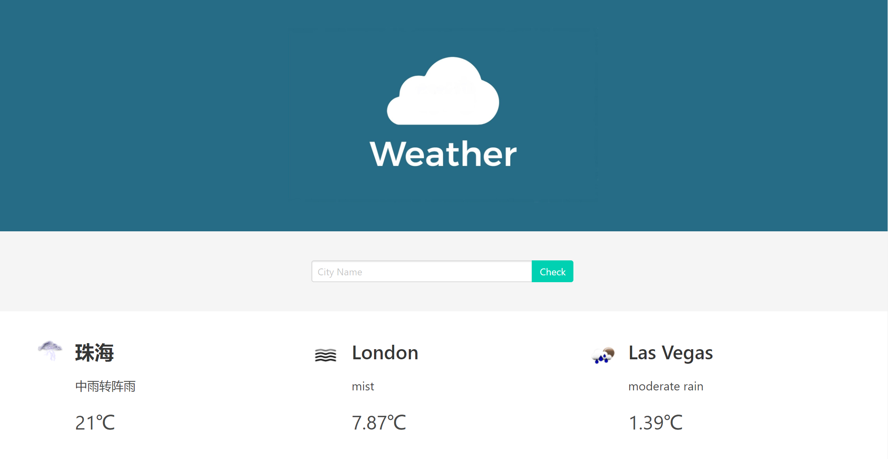

# django_weather
django_weather

# Setup
```
git clone https://github.com/zengzhengrong/django_weather.git
pipenv shell or source /path/to/ENV/bin/activate
pip install -r ./requirements.txt

python manage.py makemigrations
python manage.py migrate
python manage.py runserver
```

# AIP
Thanks a lot for these AIP to provide data
- [China's weather API](http://www.tianqiapi.com)
- [Openweather API](https://home.openweathermap.org)

# Usage
- Register the [Openweather API](https://home.openweathermap.org)
- Get the API for your account
- Add your apikey to settings.py like this :
```
APIKEY = 'your apikey'
```

# Tips
- The Openweather API can also  check China's weather by use Pinyin,but it not accuracy with some citys
- If you in China ,Please do not input with use Pinyin,Chinese is perfect
